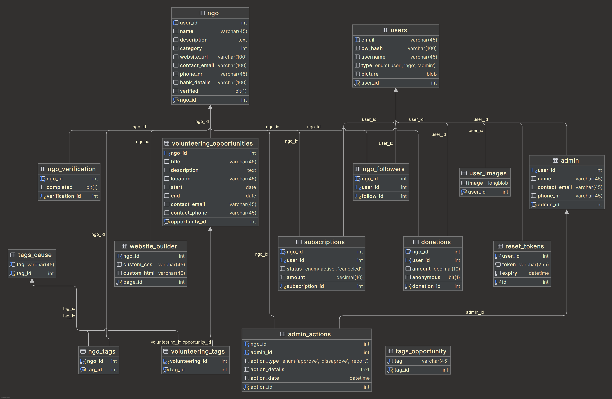
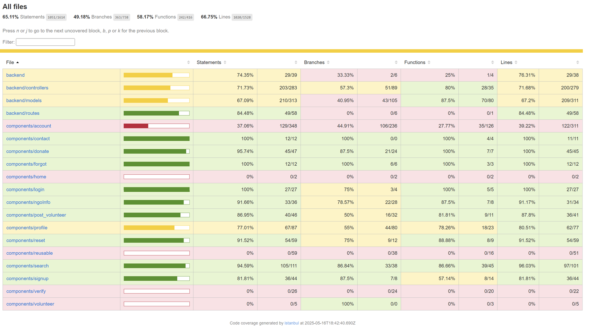

# SEWT Project Repository

## Project URL
All features you can navigate to from the homepage, you will be able to access the admin options
once you normally log in with admin credentials

* [Main login page](http://10.112.72.28:3000/)
* [Main page (external)](https://ngolib.ddns.net/)

---

## Website credentials
### Regular user
- login : charlie.lee@email.com
- password : 4444
### Special user (NGO)
- login : support@shelterhope.org
- password: 4444
### Admin / Library manager / ...
- login : kacper.szkoda@student.kuleuven.be
- password : 12345

---

## Implemented Features
Provide a short description of the actual implemented features in your project
* browse through NGOs and volunteering opportunities:
  * filter by tags of the causes they support
  * skim basic info in a digestible format
  * rerouted to the NGO page with more information and opportunity to donate
  * rerouted to an application form to easily apply to volunteer
* from the user profile:
  * look at your donation history 
  * look at and cancel your subscriptions
  * look at your followings and unfollow
  * recover your password through email
* from an NGO profile:
  * look at your followings and unfollow
  * look at your followers
  * look at your donation history
  * create volunteering opportunities
* from an admin profile:
  * monitor and filter, cancel and activate subscriptions
  * monitor and filter all user donations
  * monitor and filter NGOs pending verification
  * add and remove tags to filter by in the browse page
  * monitor and filter the admin actions log
* contact the admins via a form sending an email

## Pending features
* report donation
* verification of NGOs
* edit your NGO page display
* send email also for volunteering opportunity

## ERD

## Code coverage report
The test can be found here:
[📊 View Coverage Report](https://aj2425-team406-06d71d.pages.gitlab.kuleuven.be/)

